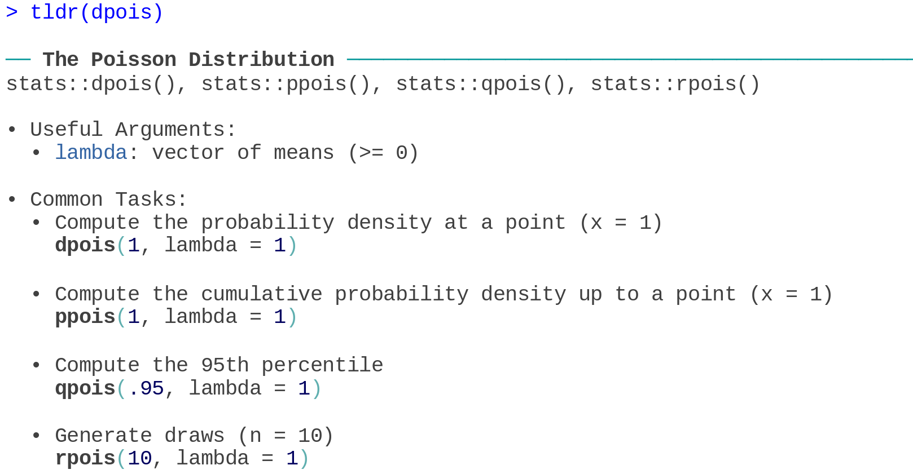
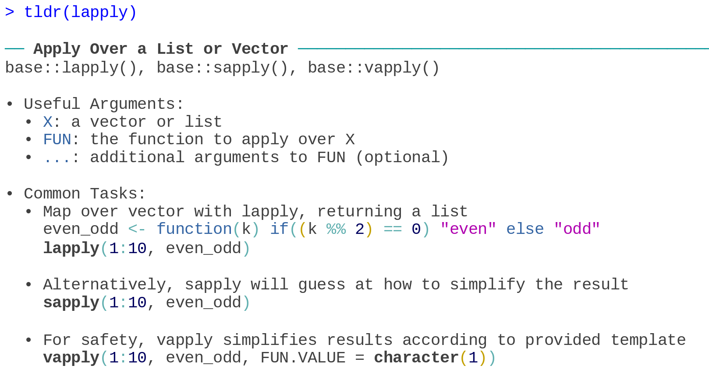

<!-- README.md is generated from README.Rmd. Please edit that file -->

```{r, include = FALSE}
knitr::opts_chunk$set(
  collapse = TRUE,
  comment = "#>",
  fig.path = "man/figures/README-",
  out.width = "100%"
)
```

# tldrDocs 

<!-- badges: start -->
<!-- [](https://cran.r-project.org/package=tldrDocs) -->

<!-- badges: end -->

**tldrDocs** provides [**tldrPages**](https://github.com/jamesotto852/tldrPages) documentation for many of the commonly-used objects included in the base distribution of R.
For example, there is documentation included for all of the distribution functions exported in **stats**---below,
we show the documentation for the `*pois()` functions:



***

Also included is documentation for the `apply()` family of functions. 
Here, we include the documentation for `lapply()`, `sapply()`, and `vapply()`:



## Installation

You can install the development version of **tldrDocs** from [GitHub](https://github.com/) with:

``` r
if (!requireNamespace("remotes")) install.packages("remotes")
remotes::install_github("jamesotto852/tldrDocs")
```

Once you have installed **tldrDocs**, you do not need to (and should not) load it via `library()`.
`tldrPages::tldr()` will be able to find the installed documentation for base R functions automatically.

## Details

The goal of **tldrDocs** is not to provide documentation for every function exported in base R---just
those that are commonly used and/or have aspects that are difficult to remember. 
If you believe that documentation is missing or existing documentation needs correcting,
please [open an issue](https://github.com/jamesotto852/tldrDocs/issues/new/choose) or [fork](https://help.github.com/articles/fork-a-repo/) this repository and submit a [PR](https://help.github.com/articles/creating-a-pull-request/).
For help on writing **tldrPages** documentation, see the [**tldrPages** repo](https://github.com/jamesotto852/tldrPages).

Note, only base packages are documented via **tldrDocs**---if
you are a package developer that wants to include **tldrPages** documentation in a package,
see [**tldrExample**](https://github.com/jamesotto852/tldrExample) for an example of a package with **tldrPages** documentation.


